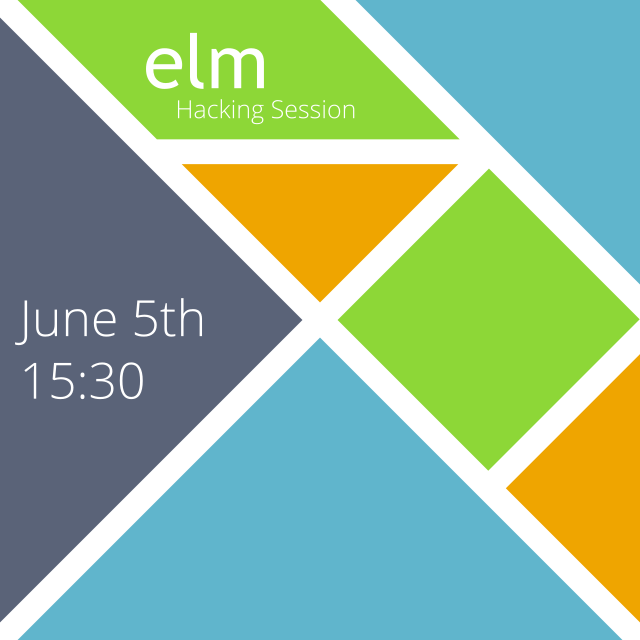

# HackSess: Elm

Quick reference for [Futurice](http://www.futurice.com/) Hacking Session on Elm.



## Super quick syntax reference

### Basics

```elm
-- This is a line comment.

isPositive : Int -> Bool  -- type annotation: takes Int, returns Bool
isPositive number = number > 0  -- function definition

someFunc : Int -> Int -> Int  -- takes two Ints, returns Int
someFunc a b =
  let sum    = a + b  -- define intermediate values let
      square = sum * sum
  in  square          -- and use them in the (in)

transformTuple : (Int, Int) -> (Float, Float)  -- example on tuples
transformTuple (a, b) =
  (toFloat a, toFloat b)
```

### Chained functions with infix operators

```elm
filled red (square 40)
-- is identical to
square 40
  |> filled red
```

```elm
rotate (degrees 60) ((move (100, 100) (filled red (square 40))))
-- is identical to
square 40
  |> filled red
  |> move (100, 100)
  |> rotate (degrees 60)
```

## Exercise

Start with these imports:
```elm
import Window
import Mouse
import Keyboard
import Debug
import Color
import Graphics.Collage exposing (..)
import Graphics.Element exposing (..)
import Time exposing (..)
```

1. Draw a triangle on a `collage`.
    - Define the `main` function
    - Triangle is a `ngon 3 sizeInPx`
2. Use the `Window.dimensions` signal to position the triangle where you want it (near a border probably).
3. Use `Mouse.position` to have it move around.
4. Use `Keyboard.arrows` instead
    - You'll need `Signal.foldp` and state for this
5. Shoot laser with an arrow key
    - Set a "shooting state" based on whether the key is down or not
6. Shoot bullets instead
    - You'll need to maintain a `List` of bullets
7. (and beyond) Just keep going! Add enemies, points, bitmap graphics, sounds, whatever!

## Relevant resources

- [Full syntax reference](http://elm-lang.org/learn/Syntax.elm)
- [Shapes example](http://elm-lang.org/edit/examples/Elements/Shapes.elm)
- [Using Signals](http://elm-lang.org/learn/Using-Signals.elm)
